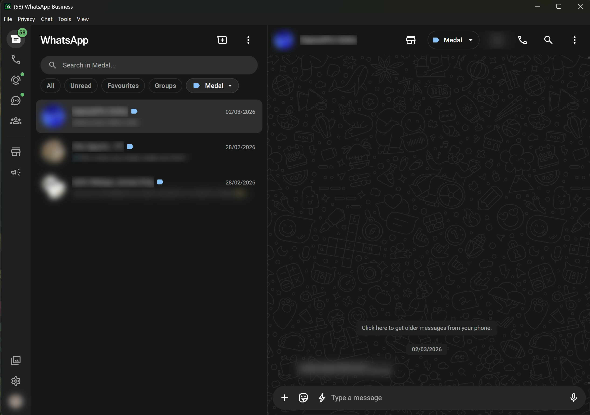
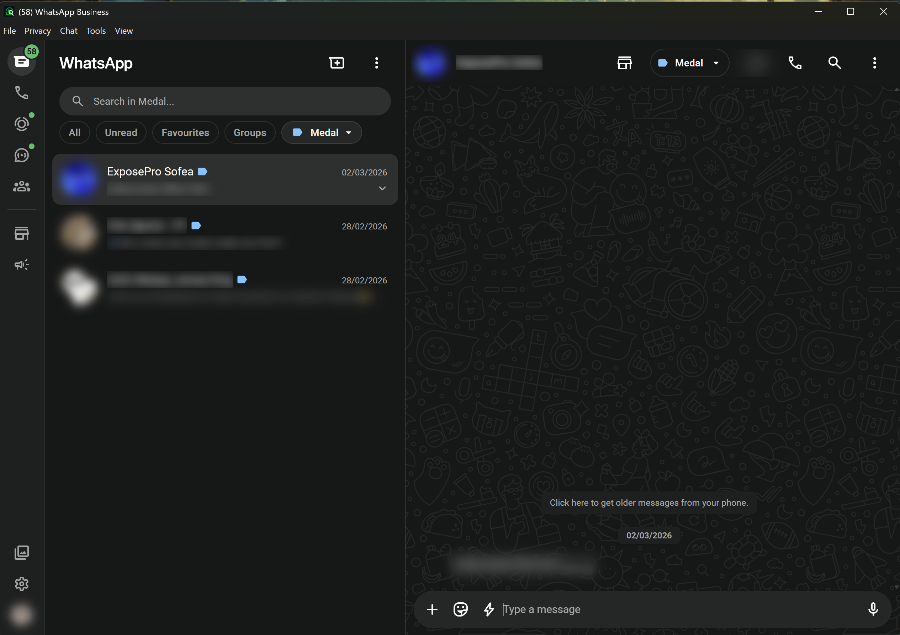
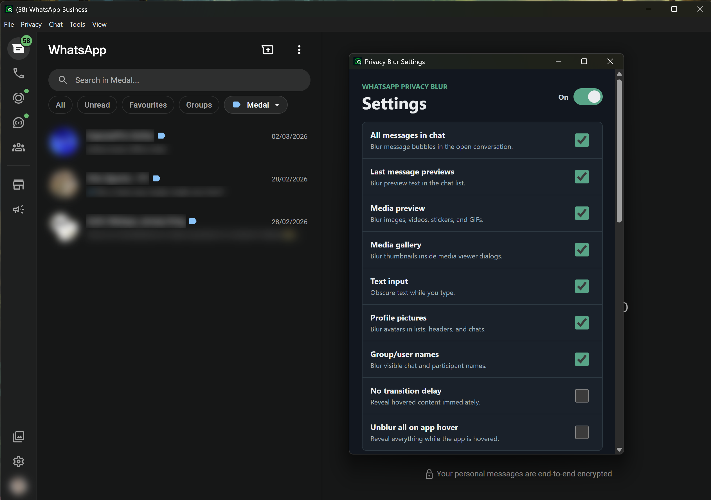
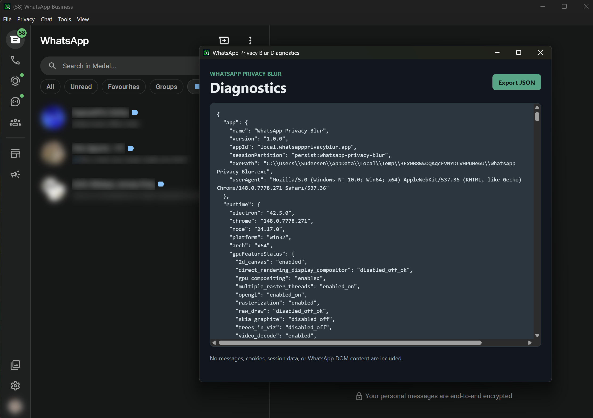

<div align="center">


# WhatsApp Privacy Blur Desktop

A standalone Windows app that adds configurable, local-first privacy controls to WhatsApp Web.


</div>

## Overview

The app wraps `https://web.whatsapp.com/` in a desktop shell with privacy controls, keyboard shortcuts, tray behavior, diagnostics, and focused workflow tools. It is intended for offices, public spaces, shared workstations, and screen-sharing sessions.

## Screenshots

| Chat Blur | Temporary Reveal |
|---|---|
|  |  |

| Settings | Diagnostics |
|---|---|
|  |  |

## Privacy controls

Configure blur for chat messages, previews, media, gallery thumbnails, text input, avatars, and user or group names.

- Hold to reveal content temporarily; it re-blurs at the end of the timeout and when the window loses focus.
- Switch between Work, Private, and Presentation profiles.
- Use `Ctrl + Alt + P` as a panic shortcut for Presentation mode.
- Optionally enable Windows capture protection. This is best effort and depends on Windows and the capture method.
- Focus mode, quiet hours, and count-only native unread notifications avoid exposing chat content.

## Desktop safety

- All renderers run in Chromium's sandbox with context isolation and validated IPC.
- Camera and microphone requests are allowed only from `web.whatsapp.com`; other permission types are denied.
- Popups are denied, and only validated HTTPS links may open in the default browser.
- The packaged app uses ASAR and Electron fuses that disable Node runtime escape hatches and extra file-protocol privileges.

## Workflow tools

- Jump to the top or latest message and cancel old-message loading.
- Restore unread-list position, copy the current chat title, and open the current chat's media or info panel when available.
- Use searchable, category-aware quick replies. Enter each as `Category :: reply text`; replies are inserted into the composer and are never sent automatically.

## Shortcuts

| Shortcut | Action |
|---|---|
| `Alt + X` | Toggle privacy blur |
| `Ctrl + ,` | Open settings |
| `Ctrl + R` | Reload WhatsApp Web |
| `Ctrl + Alt + R` | Reveal temporarily |
| `Ctrl + Alt + Home` | Go to top of current chat |
| `Ctrl + Alt + End` | Go to latest message |
| `Ctrl + Alt + Esc` | Stop loading older messages |
| `Ctrl + Alt + T` | Toggle always-on-top |
| `Ctrl + Alt + U` | Restore unread-list position |
| `Ctrl + Alt + F` | Toggle focus mode |
| `Ctrl + Alt + Q` | Open quick replies |
| `Ctrl + Alt + P` | Enable Presentation privacy mode |

## Privacy and diagnostics

The app does not collect, upload, or export WhatsApp messages, contact names, media, cookies, session files, or DOM content.

The standard diagnostics export is a local, redacted health report with app and runtime versions, privacy-control state, selector coverage, memory trends, GPU status, permission decisions, and redacted event metadata. It excludes WhatsApp text, names, URLs, local paths, cookies, and quick-reply content.

Creating a detailed support bundle requires explicit confirmation and follows the same redaction rules.

The persistent session partition is `persist:whatsapp-privacy-blur`, so WhatsApp login can persist between launches.

## Development

Install dependencies:

```powershell
cd app
npm.cmd ci
```

Run the desktop app:

```powershell
npm.cmd start
```

Run tests:

```powershell
npm.cmd test
```

Build the Windows portable executable and installer:

```powershell
npm.cmd run build
```

Run the full release verification suite (tests, dependency audit, package build, SBOM, checksum manifest, and fuse verification):

```powershell
npm.cmd run verify:release
```

Build outputs are written to `app/dist/` and are intentionally ignored by Git. CI can use `CSC_LINK` and `CSC_KEY_PASSWORD` when code-signing credentials are configured.

## Project structure

```text
app/
  assets/                  Windows icons
  scripts/                 packaging, SBOM, manifest, and fuse verification
  src/
    main.js                Electron main process and security boundary
    preload-whatsapp.js    scoped blur scanner and WhatsApp workflow controls
    security-helpers.js    URL, permission, IPC, and diagnostics validation
    settings.*             local settings UI
  test/                    Node unit tests
.github/workflows/         validation and tagged-release workflows
```

## Notes

WhatsApp Web changes frequently. If its internal layout changes, selector coverage is shown in diagnostics so partial protection can be identified and updated.

This is an independent desktop wrapper around WhatsApp Web. It is not affiliated with, endorsed by, or sponsored by WhatsApp or Meta. WhatsApp is a trademark of WhatsApp LLC.

## License

MIT License
